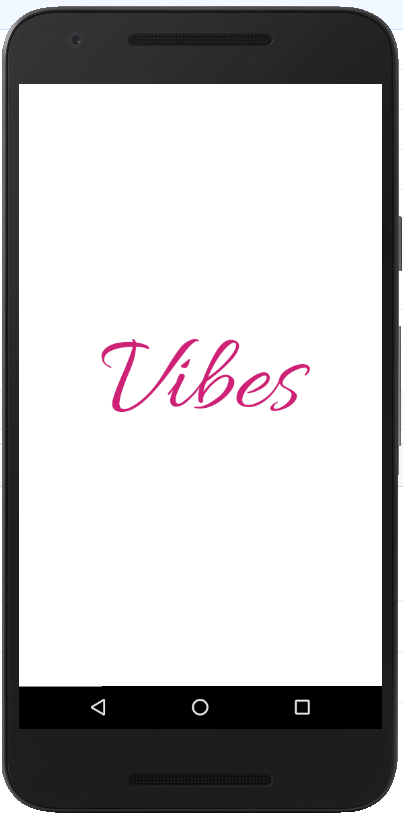
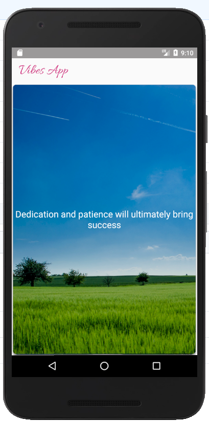
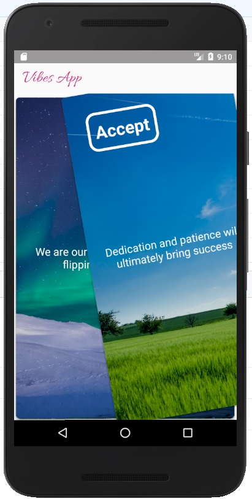
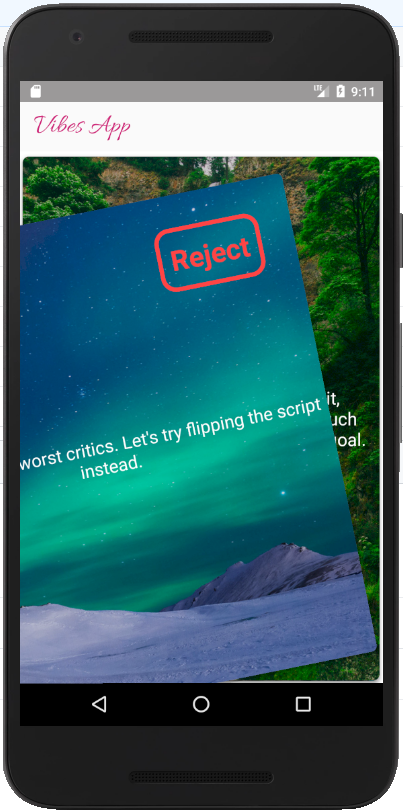

# Vibes App

### Description

The Vibes App uses many modern libraries and frameworks to create a Tinder-style positive quote reading experience for users looking for a mental boost. It uses [Vibes API](https://github.com/davidgrzyb/vibes-api) as the underlying source for positive quotes.

#### [View Screenshots](#screenshots)

### Libraries & Frameworks

- [Dagger](https://google.github.io/dagger/) - dependency injection
- [Retrofit](https://square.github.io/retrofit/) - simplified the process of working with the API
- [RxJava](https://github.com/ReactiveX/RxJava) - a reactive framework (for composing asynchronous and event-based programs)
- [PlaceHolderView](https://github.com/janishar/PlaceHolderView?fbclid=IwAR2LIUYAvPu1IKt1dEUzPLEGuUDx7cgq_YQEw_Pl2eThC7JG5Ome5lkU1w8) - for helping with the card layout design
- [Room](https://developer.android.com/topic/libraries/architecture/room) - used for database access with the goal of tracking seen and rejected quotes
- [Butter Knife](http://jakewharton.github.io/butterknife/) - field and method binding for Android views
- [MVP Architecture](https://antonioleiva.com/mvp-android/?fbclid=IwAR3F1QPnD8Bn0-xlt1rpuGy8al6zSQOL2fPlnJgJblwR72uS3VsZSwlUOlo) - used for organizing the presentation layer

### Installation

You can clone this project and run it in Android studio. You will need to geenrate your own client ID on the [Vibes API](https://github.com/davidgrzyb/vibes-api).

### Screenshots

